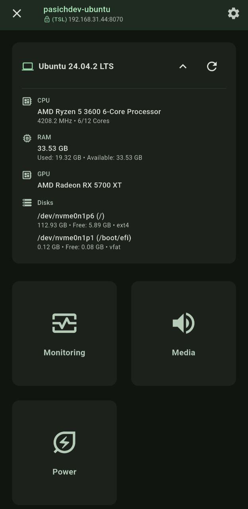
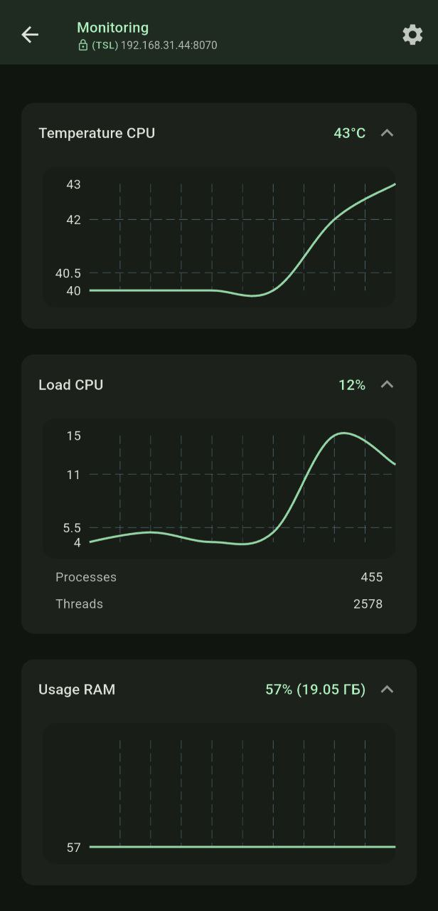
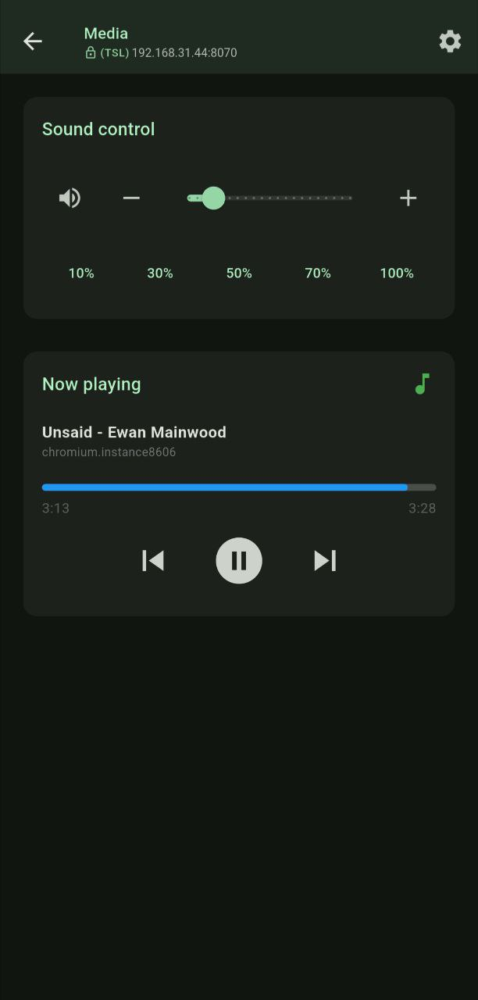
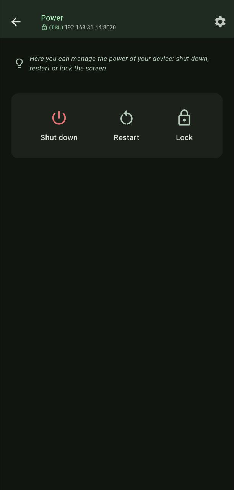

# Linqora Remote

<div align="center">


**Mobile client for Linqora — control your computer from your phone.**

</div>

## About

Linqora Remote is a mobile client application that works in conjunction with [Linqora Host](https://github.com/pasichDev/linqora/LinqoraHost) to provide remote interaction with your device.


### Requirements

- Android 7.0+
- Linqora Host running on the remote device
- Both devices must be on the same WiFi network

### Getting Started

You can use a pre-built version:

- [Releases on GitHub](https://github.com/pasichDev/linqora/releases)
- Linqora Remote on Google Play (if published)

#### Or build the application yourself using the official Flutter instructions

```bash
flutter pub get
flutter build apk --release

# The APK file will be located at build/app/outputs/flutter-apk/app-release.apk
```

#### Usage

1. Make sure Linqora Host is running on your computer
2. Launch Linqora Remote on your Android device
3. Allow the app to scan for devices on your local network
4. Select your computer from the list of discovered devices
5. Accept the connection request on your computer
6. Use the app interface to monitor and control your computer


## Screenshots

<div style="display: flex; gap: 10px; flex-wrap: wrap; ">
  
  
  
  
</div>


## License

MIT © [pasichDev](https://github.com/pasichDev)
